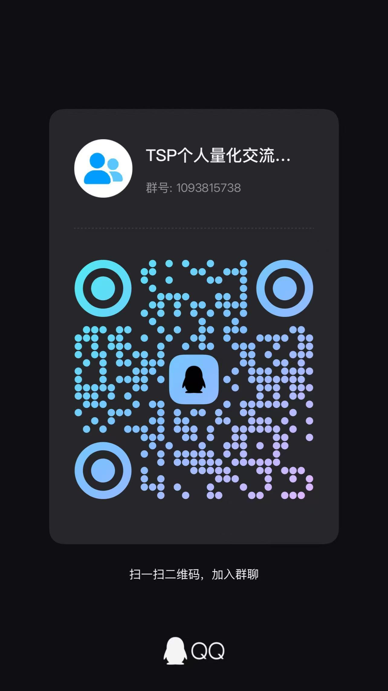

<div align="center">

# 📈 A股智能量化工作台

[](https://github.com/shy3130/tickflow-stock-panel)


**自托管、零运维的 A 股「选股 + 监控 + 回测」量化工作台**

**面向个人散户与量化爱好者而生**

[](./LICENSE)
[](https://www.python.org/)
[](https://react.dev/)
[](https://tickflow.org/auth/register?ref=V3KDKGXPEA)
[](./Dockerfile)
[](https://github.com/shy3130/tickflow-stock-panel/stargazers)

</div>

<div align="center">
  


**[快速开始](#-快速开始)** · **[核心功能](#-核心功能)** · **[配置](#️-配置)** · **[完整文档](#-完整文档)**

</div>


---


**本项目个人开源，基于 [TickFlow](https://tickflow.org/auth/register?ref=V3KDKGXPEA) 数据源，非 [TickFlow](https://tickflow.org/auth/register?ref=V3KDKGXPEA) 官方项目。仅供学习研究使用，与 TickFlow 官方无任何隶属或合作关系。** 


> ⚠️ **明确不做**:不对标同花顺 / 通达信,不内置「AI 荐股 / 涨停预测」。

有更多想法,想提交建议/意见的道友可以邮件到 415333856@qq.com,或加qq交流群 109338242（二维码在结尾），群内会不定时维护一些个性化数据。

觉得有用可以点个 Star,蟹蟹 🌹

---

## ✨ 核心功能

| 模块             | 一句话                                                                 | 详见                              |
| :--------------- | :--------------------------------------------------------------------- | :-------------------------------- |
| 🔍 **选股引擎**   | 18 个内置策略 + 自定义信号 + AI 生成 + 代码迁移,Polars 毫秒级扫全 A 股 | [strategy.md](./docs/strategy.md) |
| 📊 **指标流水线** | MA/EMA/MACD/RSI/KDJ/布林/量比等,一次扫表落盘 enriched Parquet          | [features.md](./docs/features.md) |
| 🧪 **回测引擎**   | 三种模式(个股/策略组合/自由信号),T+1/手续费/滑点/止损,SSE 流式进度     | [features.md](./docs/features.md) |
| 📡 **监控中心**   | 四类监控(策略/个股信号/价格/异动),多条件 AND/OR + 飞书推送             | [features.md](./docs/features.md) |
| 📈 **个股分析**   | 9 类关键价位 + AI 四维分析(技术/基本面/财务/消息面)                    | [features.md](./docs/features.md) |
| 🏆 **连板梯队**   | 连板层级统计 + 概念涨幅轮动 + 盘后 AI 复盘 + 炸板/翘板预警             | [features.md](./docs/features.md) |
| 🧰 **数据扩展**   | TickFlow 多源 + 第三方接入(接口/推送/CSV/JSON)同台分析                   | [features.md](./docs/features.md) |


<details>
<summary><b>📦 主要页面与功能</b></summary>

**📊 行情总览**
- **看板** Dashboard — 市场情绪评分 + 涨跌/成交额榜单 + 概念领涨领跌 + 大盘异动事件流,一日全貌
- **自选** Watchlist — 自选股池,表格/卡片双视图,换手/量比/RSI 等实时指标
- **指数** Indices — 沪深指数浏览与同步

**🔍 选股与回测**
- **策略** Screener — Polars 毫秒级扫描全 A 股,18 个内置策略卡片 + 自定义条件
- **回测** Backtest — 两种模式:
  - **因子回测** — IC/IR、分层收益、多空组合,先筛掉无效指标
  - **策略回测** — 净值曲线、回撤、夏普、胜率,支持 T+1/手续费/滑点/止损,SSE 流式进度

**📈 个股与板块分析**
- **个股分析** Stock Analysis (Beta) — 日K + 9 类关键价位 + AI 四维分析(技术/基本面/财务/消息面)
- **财务分析** Financials — 利润表/资负表/现金流/关键指标 + AI 解读
- **概念分析** Concept Analysis — ths 概念涨幅轮动矩阵 + 领涨/领跌主线 + 个股穿透
- **行业分析** Industry Analysis — 行业分层涨幅轮动 + 领涨/领跌主线 + 成分股
- **连板梯队** Limit Up Ladder — 连板层级统计 + 概念/行业分布 + 封单监控(可切换连跌梯队)

**🔔 监控与复盘**
- **监控中心** Monitor — 策略/个股信号/价格/异动四类规则,盘中实时弹窗 + 触发记录持久化
- **复盘** Review (Beta) — 盘后 AI 自动生成市场复盘,可定时执行、推送飞书、下载 Markdown

**🗄️ 数据与扩展**
- **数据** Data — 本地数据画像与同步状态(维表/日K/除权/Enriched/指数/ETF/分钟K/财务),盘后管道与历史扩展
- **扩展分析** (动态菜单) — 把任意第三方/扩展数据字段配成一级菜单,与内置数据同台分析
- **设置** Settings — TickFlow Key 与订阅档位、AI 接口、实时监控、扩展页面、信号库、菜单与系统设置

</details>


---

## 📸 界面预览

<table>
  <tr>
    <td width="50%" align="center"><b>看板 Dashboard</b></td>
    <td width="50%" align="center"><b>策略 Screener</b></td>
  </tr>
  <tr>
    <td width="50%"></td>
    <td width="50%"></td>
  </tr>
  <tr>
    <td width="50%" align="center"><b>回测 Backtest</b></td>
    <td width="50%" align="center"><b>监控中心 Monitor</b></td>
  </tr>
  <tr>
    <td width="50%"></td>
    <td width="50%"></td>
  </tr>
  <tr>
    <td width="50%" align="center"><b>连板梯队 Limit Ladder</b></td>
    <td width="50%" align="center"><b>概念分析 Concept</b></td>
  </tr>
  <tr>
    <td width="50%"></td>
    <td width="50%"></td>
  </tr>
</table>

<div align="center">

### 📸 [查看更多界面截图 »](./screenshots/README.md)

</div>


---


## 🚀 快速开始

> 前置依赖:Python ≥ 3.11 · Node ≥ 20 · [`uv`](https://docs.astral.sh/uv/) · `pnpm`(`npm i -g pnpm`)

### 方式 A:Dev 模式(二次开发推荐)

```bash
cp .env.example .env       # 按需填 TICKFLOW_API_KEY(留空 = None 模式)
./dev.sh                   # Windows: .\dev.ps1
```

自动检查 / 下载依赖、释放端口、同时起前后端。后端 → <http://localhost:3018> · 前端 → <http://localhost:3011>。

### 方式 B:Docker(部署最省心)

```bash
cp .env.example .env
docker compose up --build
# 打开 http://localhost:3018
```

镜像已内置 **stock-sdk** 数据源插件(Node 运行时 + 依赖),开箱即用。
如需使用 `tdx-api` 通达信代理池数据源,把 SOCKS5 配置写入
`docs/zhihu/tdx-api/.env`,启动后在 **设置 → 数据源** 选择
`tdx-api(通达信代理池)`。

> 📖 Docker 进阶、GitHub Actions 自构建、老 CPU 兼容、访问密码设置等见 [docs/deployment.md](./docs/deployment.md)。

### 跑起来后的第一次使用

1. **设置 → 凭据与能力** → 点 **重新检测**,确认档位标签
2. **设置** → **立即跑盘后管道**:拉日 K + 计算 enriched 表(None / Free 走 free-api,当日数据盘后 1-2 小时可用)
3. **自选**页加标的 → **选股**页点策略卡片扫描 / 配自定义信号
4. **回测**页选策略 + 区间 → 看净值 / 夏普 / 交易明细(SSE 实时进度)
5. **监控中心**配规则,盘中实时弹窗 + 持久化记录

---

## ⚙️ 配置

所有配置从根目录 `.env` 读取(复制 `.env.example` 开始),也可在面板 **设置** 页修改。最常用的三项:

```ini
TICKFLOW_API_KEY=              # 留空 = None 模式(历史日K免费);填 Key 解锁更多
AI_API_KEY=                    # 留空 = 关闭 AI;填 Key 启用策略生成
PORT=3018                      # 服务端口
```

> 📖 完整配置项(数据源档位、AI、服务、密码、老 CPU 兼容)见 [docs/configuration.md](./docs/configuration.md)。

---

## 🏗️ 技术栈

| 层           | 选型                                                                                              |
| :----------- | :------------------------------------------------------------------------------------------------ |
| **后端**     | FastAPI · Pydantic v2 · APScheduler · sse-starlette                                               |
| **数据**     | Polars(计算)· DuckDB(查询)· Parquet(存储)                                                         |
| **回测**     | vectorbt(全项目唯一 pandas 边界)                                                                  |
| **数据源**   | [TickFlow](https://tickflow.org/auth/register?ref=V3KDKGXPEA) 官方 SDK · 其他数据源后续迭代实装   |
| **AI**(可选) | OpenAI 兼容接口(DeepSeek / 通义 / Ollama 等)                                                      |
| **前端**     | React 18 · Vite · TypeScript · Tailwind · Tanstack Query · Lightweight Charts · ECharts · dnd-kit |
| **部署**     | Docker 两阶段构建,前端 dist 拷进后端镜像,**单容器**                                               |

---

## 🗺️ 路线图

| Phase  | 内容                                                               | 状态 |
| :----- | :----------------------------------------------------------------- | :--- |
| 0-1    | 仓库骨架 · FastAPI 壳 · 能力探测 · K 线同步与分析页                | ✅    |
| 2-3    | Polars enriched 流水线 · Screener · vectorbt 回测(T+1/手续费/止损) | ✅    |
| 4-5    | 监控引擎 · 四类监控规则 · 实时 SSE 推送 · 持久化记录               | ✅    |
| 6      | 个股分析(专用日 K + 9 类关键价位 + AI 四维分析)                    | ✅    |
| **v2** | Webhook 推送(QMT/掘金下单)· 板块异动 · 早晚报 · 更多扩展           | 🚧    |

---

## 📚 完整文档

| 文档                                                                                               | 内容                                                                 |
| :------------------------------------------------------------------------------------------------- | :------------------------------------------------------------------- |
| [docs/deployment.md](./docs/deployment.md)                                                         | 部署方式(Dev / Docker / GH Actions)、老 CPU 兼容、更新代码、访问密码 |
| [docs/configuration.md](./docs/configuration.md)                                                   | 所有 `.env` 配置项详解(数据源、AI、服务、密码、数据目录)             |
| [docs/features.md](./docs/features.md)                                                             | 各功能模块详细说明(选股/指标/回测/监控/个股分析/数据扩展)            |
| [docs/custom-data-source.md](./docs/custom-data-source.md)                                         | 自定义数据源接入、YAML 配置与 mock 联调示例                         |
| [docs/strategy.md](./docs/strategy.md)                                                             | 策略体系(18 内置策略 + 三种扩展方式 + 文件结构)                      |
| [backend/app/strategy/prompts/strategy-guide.md](./backend/app/strategy/prompts/strategy-guide.md) | 策略开发完整规范(AI 生成与手写)                                      |

fork同时请点个star哦,欢迎 Issue 和 PR。

---

## 💬 交流群

欢迎加入交流群,讨论使用问题、功能建议或量化策略。



---

## ⚠️ 免责声明

本项目仅供**学习与量化研究**,**不构成任何投资建议**。回测结果不代表未来收益。A 股有风险,入市需谨慎。数据准确性以数据源 TickFlow 官方为准。

## 📄 License

[MIT](./LICENSE) © tickflow-stock-panel contributors 

本项目依赖 [TickFlow](https://tickflow.org/auth/register?ref=V3KDKGXPEA) 提供数据服务,使用前请遵守其服务条款

数据源插件 [stock-sdk](https://stock-sdk.linkdiary.cn) 遵循其各自的 ISC 协议。

## 社区

本开源项目已链接并认可 [LINUX DO 社区](https://linux.do)。
