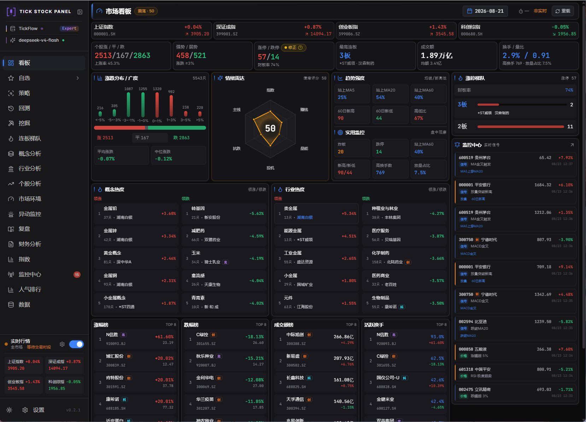
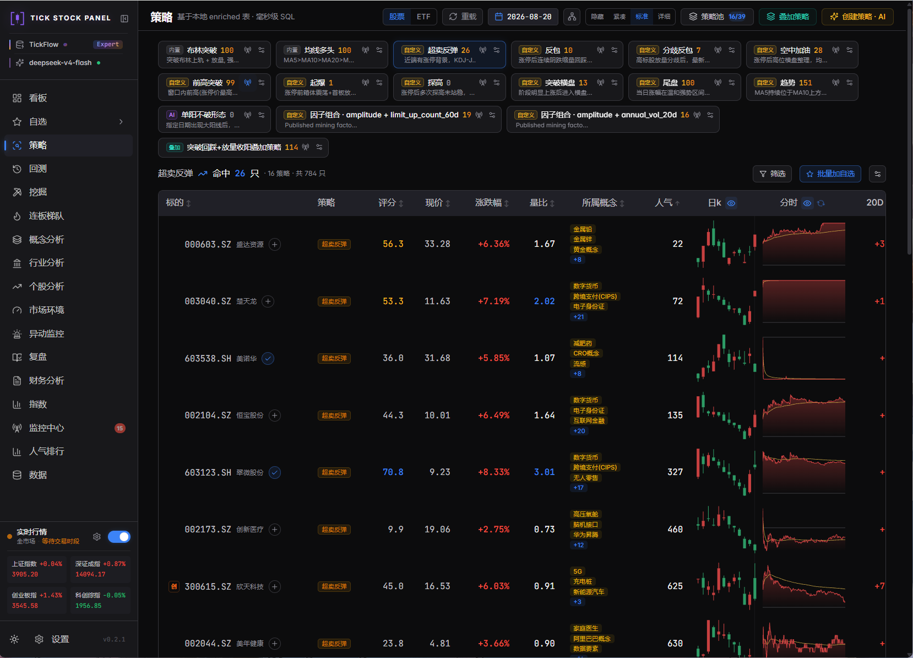
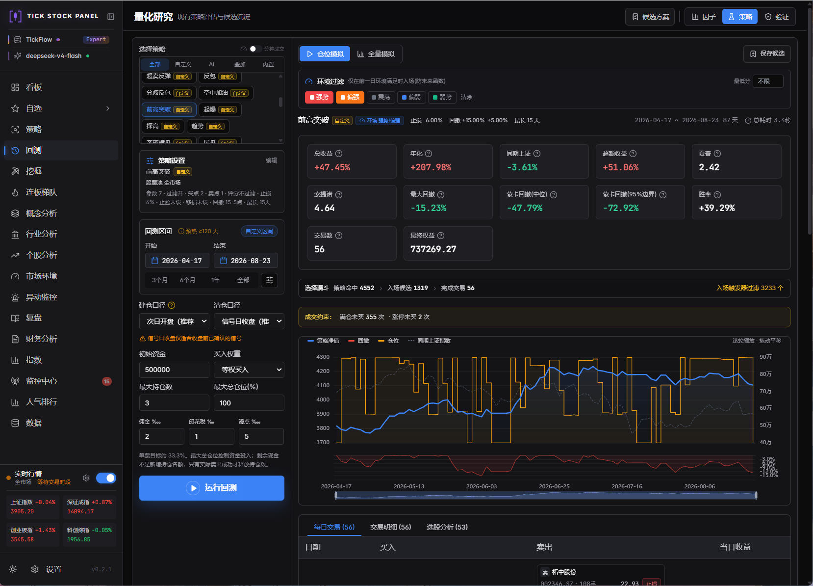
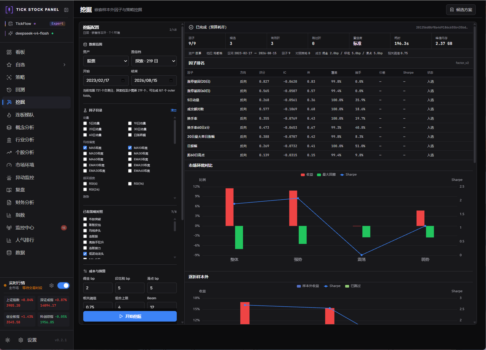
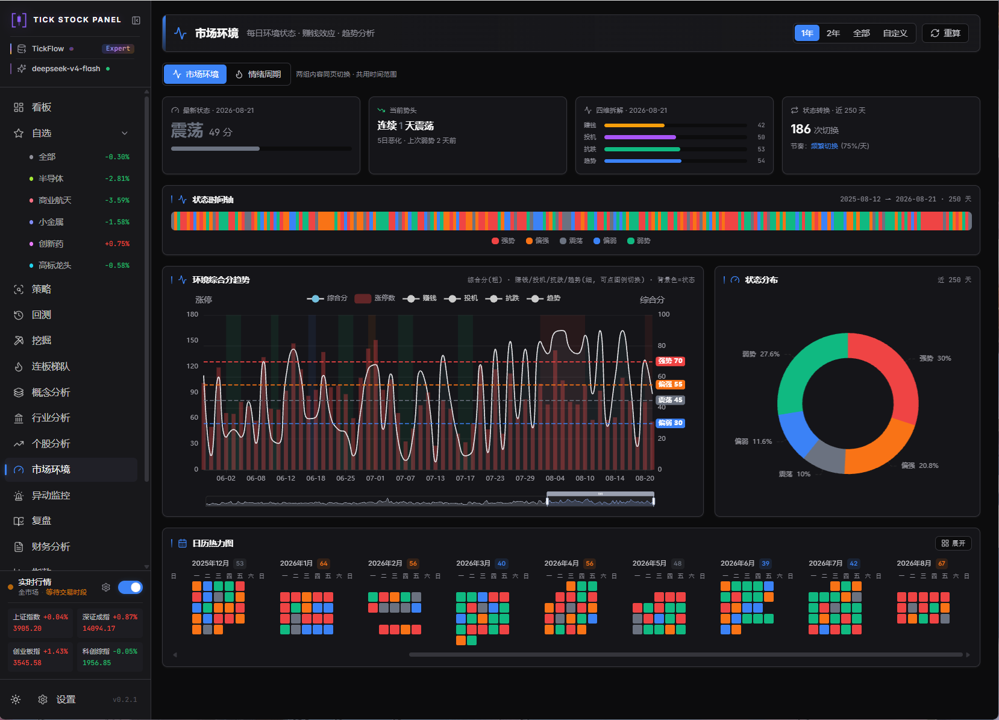
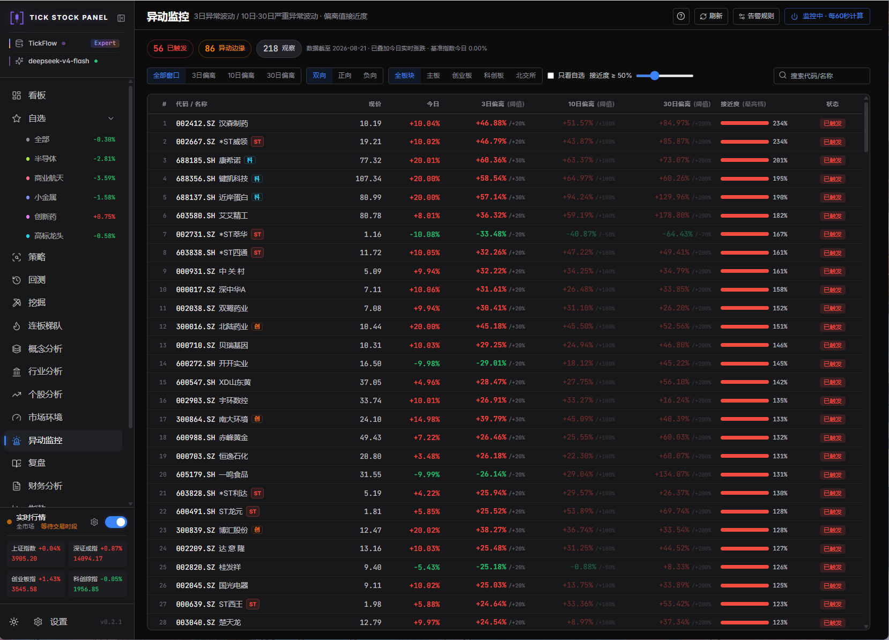
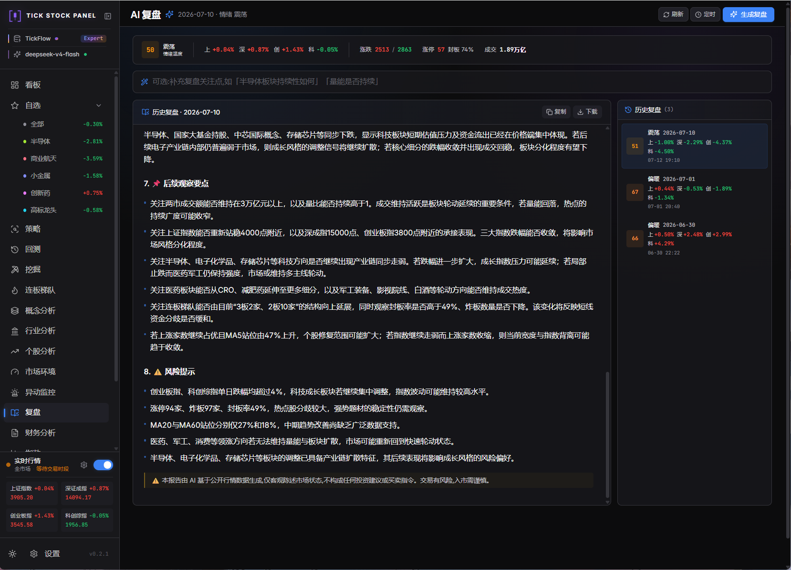

# 项目截图

### 看板 Dashboard

### 自选 Watchlist

### 策略 Screener

### 回测 Backtest

### 挖掘 Mining

### 市场环境 Regime

### 异动监控 Abnormal Moves

### 监控中心 Monitor

### 连板梯队 Limit Ladder

### 概念分析 Concept

### 财务分析

### 财务分析报告

### 个股分析

### 个股分析报告

### 复盘 Review

### 飞书推送-自动复盘

### 飞书推送-个股监控

